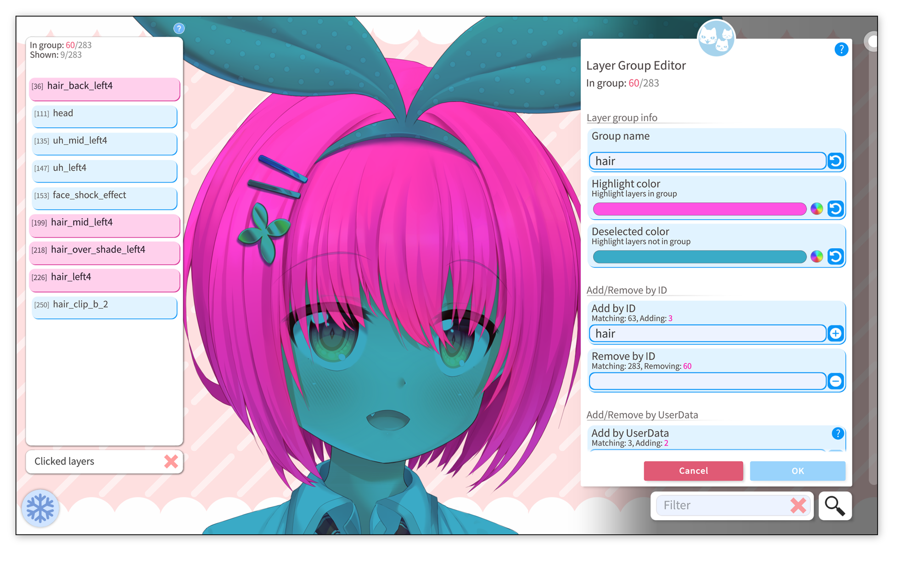
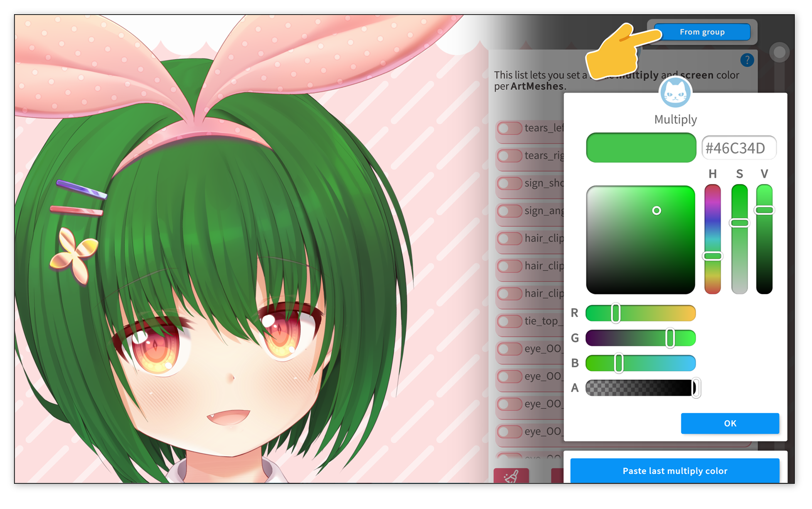

### ⚠️ 目前仅在**测试分支**中提供 ⚠️

你可以为自己的模型设置**图层/网格分组**。这些分组可以包含任意数量的图层/网格，并且能在软件的其他功能中使用，例如可以同时为分组内的**所有图层/网格添加功能**（[添加特殊网格功能](Add-Special-ArtMesh-Functionality.md)）。

本文中提及的“图层”，均指代网格（Live2D 模型图层的专业名称）。

## 配置图层分组
要打开图层分组编辑器，请点击**“自定义模型”**，然后选择**“配置图层分组”**。

在图层编辑器中，你可以选中所有需要加入分组的图层。图层名称旁的数字代表该网格在模型中的当前排序（排序可能会随着操作发生变化，此数字为打开列表时的排序状态）。

你也可以使用文本筛选功能过滤列表，或点击模型，只显示点击位置对应的网格。

为了更直观地区分分组内/外的图层，你可以设置**“高亮颜色”**和**“未选中颜色”**。

除了手动逐个添加图层外，你还可以**通过 ID 批量添加/移除**图层。例如，在**“按 ID 添加”**输入框中输入“hair”，软件会将所有 ID 中包含“hair”的图层加入分组。此功能需要模型的网格 ID 经过合理配置（许多绑定师会直接使用默认名称，如`ArtMesh1`、`ArtMesh2`等）。在执行添加操作前，VTube Studio 会展示所有即将被添加的图层列表。

你也可以**通过用户数据（UserData）批量添加**图层，该功能的详细说明见下文。

完成**图层分组配置**后，你就可以用这个分组为网格批量添加功能了。

例如，你可以通过图层分组，同时为多个图层进行**[网格重着色](Add-Special-ArtMesh-Functionality.md)）**。

## 为 Live2D 挂件配置图层分组
当你将 Live2D 模型作为挂件加载时，模型的所有分组都会同步到挂件中。

除此之外，你也可以直接在 Live2D 挂件中创建图层分组。只需**长按**挂件（按住不放），打开**挂件设置**，然后选择**“配置图层分组”**即可。

## 网格用户数据标签
另一种批量选择图层的方式是使用**用户数据标签（UserData Tags）**。

用户数据标签是绑定师在 Live2D 编辑器中，通过填写用户数据（UserData）字段，为网格添加的标记。

每个网格都有对应的用户数据字段，你可以在其中输入任意数量的标签。VTube Studio 会按照空格和换行符，将字段内容拆分为独立的标签。

绑定师可以提前设置这些标签/分组，方便后续在软件中对模型图层进行筛选，以实现更多功能。

使用用户数据功能时，请确保在 Live2D Cubism 中导出模型时，勾选**“导出用户数据（Export UserData）”**选项。

