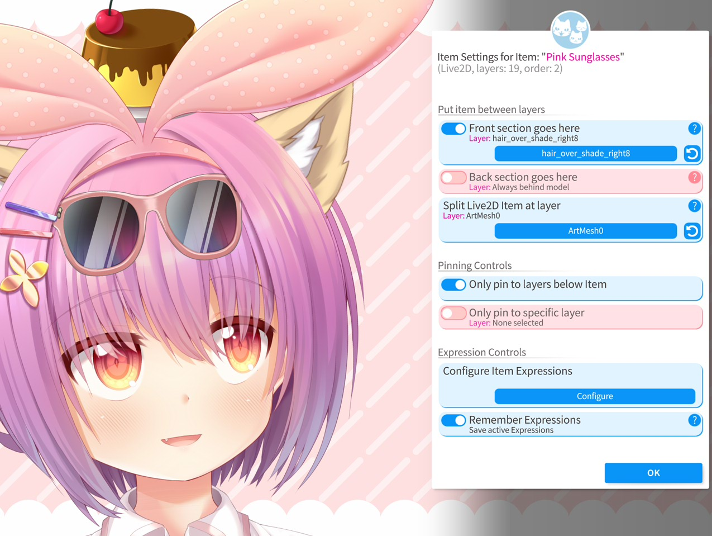

## 在 Live2D 模型图层间放置普通挂件

**注意**：本手册页面与 VTube Studio 界面中，「layer（图层）」和「ArtMesh（网格，Live2D 模型图层的专业术语）」视为同一概念交替使用。

VTube Studio 支持将 [挂件](Item-System.md) 放置在已加载的主 Live2D 模型的各图层之间。首先请确保已加载一个 Live2D 模型，再加载任意一个挂件（Live2D 挂件或 PNG、GIF 等图像挂件均可）。随后，**长按**该挂件 1 秒钟。

此时会弹出如下菜单：

此外，你也可以点击对应按钮打开「已加载挂件列表」菜单，从中选中目标挂件：

在该挂件的专属设置菜单中，可配置其各项参数。若要将挂件放入模型图层之间，需开启「将挂件置入模型」选项，并选择目标图层。挂件会被插入到所选图层的**上方**。该功能激活后，挂件相对于场景中其他挂件的「挂件顺序」设置将不再生效。

{: height="59px" width="189px"}

Live2D 模型的图层（网格面片）顺序可能会随时间动态变化。例如，某一缕头发的图层可能会根据追踪数据或正在播放的动画/表情，切换至模型的前景或背景。VTube Studio 会逐帧追踪这些图层顺序的变化，并根据网格面片顺序调整，精准修正挂件在模型中的插入位置。

通常，挂件会根据所选的图层 ID 被置入模型图层之间。不过，图层选择器中还有两个特殊选项可供选择：

* **最顶层**：始终显示在模型的最前方。

* **最底层**：始终显示在模型的最后方。

若两个挂件被插入到同一模型图层的上方，则会依据它们自身的核心挂件顺序，决定彼此的前后显示关系。

## 更换不同模型后该功能是否仍然有效？

挂件在模型内的显示顺序由所选的图层 ID 决定（若选择「始终在模型最前/最后」则除外）。

只要新加载的模型包含该图层 ID，挂件就会被排序到对应图层的上方。若模型中没有该图层 ID，挂件将按照常规的挂件顺序排序，且不会被置入模型图层之间。此时打开挂件配置菜单，图层名称旁会出现警告提示。

在 [VNet 多人联机](Multiplayer.md) 协作时，若你将挂件固定到其他参与者的模型上，且该挂件开启了「将挂件置入模型」功能，也会遵循上述规则。

## 将 Live2D 挂件固定到模型图层之间

和普通挂件一样，Live2D 挂件也可以被固定到模型的图层之间。

不过 Live2D 挂件拥有更多配置选项，其挂件配置菜单的界面也略有不同：

你可以选择一个图层 ID 作为分割点，将 Live2D 挂件**拆分**为前景和背景两个部分。之后，可将**前景部分**和**背景部分**分别插入到模型的不同位置。例如，你可以将**前景部分设为始终在模型最前**，同时将**背景部分设为始终在模型最后**。

通过这种方式，你可以制作出能够「包裹」模型的素材，比如让模型看起来像是真的戴上了帽子、裹上了毯子等效果。

需要注意的是，与普通挂件相同，当主模型的图层顺序在加载状态下发生变化时，VTube Studio 会逐帧自动调整 Live2D 挂件前后两部分的显示层级。同时 VTube Studio 会确保前景部分不会移动到背景部分的后方。

### 面向建模师：设置 Live2D 挂件的拆分点

在将 Live2D 挂件发送给客户之前，你可以在 VTube Studio 中为其设置拆分点（前景/背景的分界）。任何图层都可以作为拆分点，若希望 VTube Studio 自动为挂件设置默认拆分点，只需在某一个图层的名称中加入关键词 `split`（不区分大小写）即可。VTube Studio 会将第一个包含 `split` 关键词的图层设为默认拆分点。

## 特殊固定选项

在挂件配置菜单中，你还可以自定义该挂件的固定规则，具体包含以下选项：

* **仅固定到挂件下方的图层**：该挂件只能被固定到位于其自身下方的模型图层。

* **仅固定到指定图层**：该挂件只能被固定到此处设置的单个图层。

* **显示固定通知**：开启后，每当你将挂件固定/解除固定到某个图层时，都会弹出通知并显示该图层的名称。若挂件被错误固定到其他图层，此功能可提供帮助：确认对应图层后，在 [模型网格面片自定义设置](Add-Special-ArtMesh-Functionality.md) 中关闭该图层的固定功能即可。

{: width="580px"}

## 其他杂项设置

挂件配置菜单中还有一些其他功能选项，例如：

* **为前景/背景着色**：在图层选择器激活时，高亮显示所选的图层。该效果会在 OBS 捕获的画面中呈现。

* **配置挂件表情**：可为挂件设置表情，开关表情状态并为其绑定快捷键。相关详情请参阅：[表情系统](Expressions-(a.k.a.-Stickers-or-Emotes).md)

* **翻转挂件**

* **删除挂件**

* **锁定挂件**

* **打开 Live2D 挂件设置**：在此处可自定义 Live2D 挂件的各项参数如s何根据追踪数据产生联动。

* **打开全局挂件设置**：在此处可开关拖放功能、启用/禁用特定类型文件的加载权限等。

## 通过 VNet 同步

在 [VNet 多人联机](Multiplayer.md) 协作时，挂件在各参与者模型内的显示顺序会被完全同步。

若你将挂件固定到其他参与者的模型上，只要对方的模型包含对应的图层 ID，或你选择了「始终在模型最前/最后」的特殊选项，该挂件就会被插入到对方的模型图层之间。