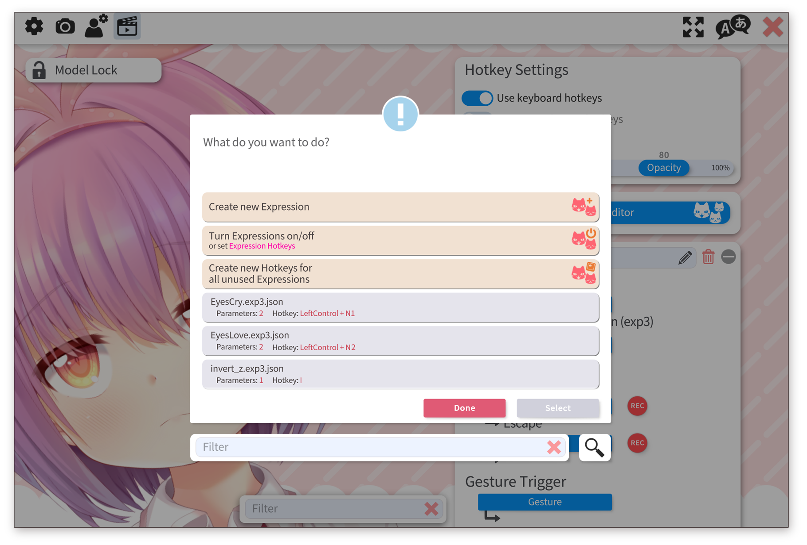

## 按键表情制作

按键表情功能允许你通过快捷键将 Live2D 参数设置为特定数值。借助按键表情功能，你可以触发不同的面部表情、切换服装，还能通过按键表情参数的**叠加/倍增**模式调整追踪效果。

按键表情可直接在 VTube Studio 的「快捷键」选项卡中设置。

在此处，你可以**创建新按键表情**、**编辑现有按键表情**，或**为所有未绑定快捷键的按键表情自动创建快捷键**。同时，无需使用快捷键，你也能在此直接**开启/关闭按键表情**。

编辑或创建按键表情时，会弹出以下窗口。勾选或取消勾选你希望纳入按键表情的 Live2D 参数即可。物理输出参数无法用于按键表情，因其数值会被物理系统覆盖。

保存新按键表情后，模型目录下会生成一个 `.exp3.json` 文件。若你的模型已有单独的按键表情文件夹，VTube Studio 会将新按键表情保存至该文件夹中。

> 注意：此外，也可通过 **Live2D Cubism Viewer** 制作按键表情。该工具可作为 Live2D Cubism Editor 的一部分免费下载：https://www.live2d.com/en/download/

## 按键表情使用方法

在 VTube Studio 中使用按键表情的步骤如下：

1.  按照快捷键相关章节的说明，在 VTube Studio 中创建新快捷键。
2.  将快捷键类型设置为「启用/取消按键表情」。
3.  从列表中选择你的按键表情文件。若未找到该文件，请确保 `.exp3.json` 文件与 VTS 模型文件位于同一文件夹或其子文件夹中。
4.  快捷键设置完成，你可通过键盘或屏幕按钮激活、关闭按键表情。

## 按键表情的开启与关闭

如前文所述，你可以通过快捷键开启/关闭按键表情。此外，也可在按键表情编辑器菜单中选择「开启/关闭按键表情」，直接切换按键表情状态。

在此菜单中，你可手动开启/关闭按键表情，还能点击键盘图标，为每个按键表情直接创建、删除或修改快捷键组合。若某个按键表情尚未绑定快捷键，在此处设置组合键后，系统会自动为该模型创建对应的快捷键。

该菜单同样适用于挂件（在 [挂件设置](Between-Layer-Item-Pinning.md) 中），因此你也能轻松为已加载的挂件直接设置按键表情及对应的快捷键。

## 按键表情参数模式

默认情况下，在按键表情中设置参数数值时，会直接将 Live2D 参数赋值为该数值。不过，你可以为按键表情中的每个参数修改这一「模式」。

支持的模式如下：

* **覆盖模式**：默认模式，直接将参数设置为指定数值。

* **叠加模式**：将指定数值与参数当前值相加。

* **倍增模式**：将参数当前值与指定数值相乘。

例如，将倍增数值设为 `-1` 时，可通过倍增模式反转追踪数值。

某个参数的叠加/倍增计算会在**所有其他操作之后**执行并生效。示例如下：

  * 若有两个按键表情均对 Live2D 参数 `ParamA` 施加 `0.5` 的倍增效果，该参数最终的倍增系数将为 `0.25`。

  * 若经过追踪、动画等操作后，Live2D 参数 `ParamA` 的数值为 10，且有按键表情对其设置了 `0.5` 的倍增系数，那么该参数的最终数值将为 5。

**注意**：对于同一参数，会先执行所有倍增操作，再执行所有叠加操作。

点击模式图标即可切换参数模式。

{: height="59px" width="189px"} 
当多个快捷键修改同一 Live2D 参数时，将采用最后激活的快捷键所设定的数值。关闭该「最后激活」的快捷键后，参数数值会恢复为前一个快捷键设定的值。当所有修改某一 Live2D 参数的快捷键均被关闭时，该参数将恢复为动画设定值、面部追踪值或默认值。

例外情况：按键表情中设置为**叠加**或**倍增**模式的参数，会始终同时生效。

更多详情请参阅章节：
[动画、按键表情、面部追踪、物理系统等之间的交互](Interaction-between-Animations-Tracking-Physics-etc.md)
