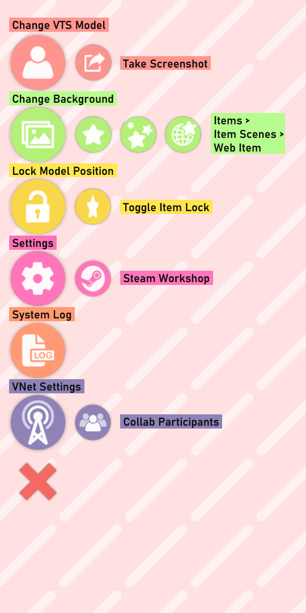
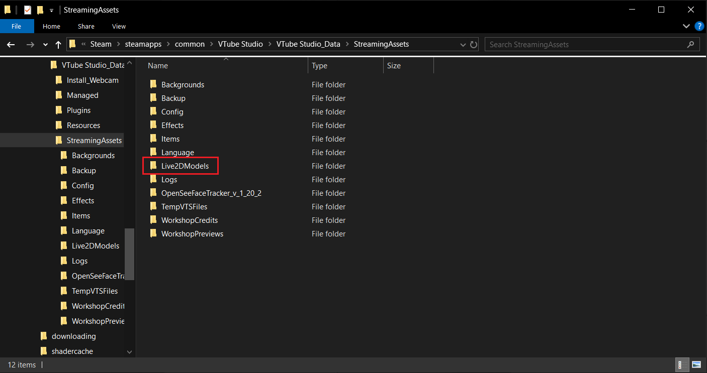

此页面将引导你理解 VTube Studio 的菜单选项，并简要概述如何导入和设置 Live2D 模型并进行推流。

> **注意:** 如果你有 3D 模型，此页面不包含有关 VTube Studio 与 VSeeFace 配合使用的信息。请参阅 "[向VSeeFace发送数据](Vtube-Studio-Settings.md)" 页面。

要跳转到特定部分，请单击以下链接之一:

- [启动应用程序](#启动应用程序)
- [了解主菜单](#了解主菜单)
- [导入Live2D模型](#导入Live2D模型)
- [配置你的模型](#配置你的模型)
- [校准摄像头](#校准摄像头)
- [有关加载模型的视频教程](#视频教程)

# 启动应用程序

在智能手机上，第一次启动 VTube Studio 时，系统会提示你授予应用程序访问媒体文件、拍照以及录制视频和音频的权限。你 _必须_ 授予这些权限才能使 VTube Studio 正常工作。

在移动版和 PC 版上，应用程序启动后，你将看到两个弹出通知。第一个是关于使用 2.4GHz WiFi 连接时潜在延迟问题的警告。第二个是关于应用程序提供的默认 Live2D 模型。如果你不想每次打开 VTube Studio 时都看到这些通知，请打开“不再显示”按钮。

# 了解主菜单

VTube Studio 的移动应用程序和 PC 版本的主菜单非常相似 - 你可以在下面看到两个版本之间的细微差别（移动设备在左侧，PC 设备在右侧）。

下表描述了每个菜单选项的用途。有些选项有指向单独 wiki 页面的链接，你可以在其中了解有关它们的更多信息。

| **选项** | **描述** | **是否仅限移动端或PC端** |
| ---------- | --------------- | -------------------- |
| 切换相机预览 | 打开/关闭相机预览 | 移动端 |
| 校准相机 | 校准相机 _而不_ 显示相机预览 | 移动端 |
| 更换Live2D模型 | 打开模型选择栏 | 共通 |
| [截图](Taking-Sharing-Screenshots.md) | 直接在应用程序中截图 | 共通 |
| 更换背景 | 打开背景选择器 | 共通 |
| [挂件](Item-System.md) | 把挂件导入到场景中 | 共通 |
| [挂件场景](Item-Scenes-and-Item-Hotkeys.md) | 设置可以通过快捷键切换的挂件集合 | 共通 |
| [Web挂件](Web-Items.md) | 添加 Chromium Web 浏览器挂件 | PC端 |
| 锁定模型位置 | 锁定模型位置，使其在触摸屏幕时无法移动，不禁用面部捕捉 | 共通 |
| 切换挂件锁定 | 锁定/解锁场景中的所有挂件 | 共通 |
| [设置](Vtube-Studio-Settings.md) | 打开设置菜单 | 共通 |
| [Steam创意工坊](Workshop.md) | 打开Steam创意工坊菜单 | PC端 |
| 系统日志 | 打开系统日志 | 共通 |
| [VNet 设置*](Multiplayer.md) | 打开VNet协作菜单 | PC端 |
| 协作参与者* | 打开协作控制界面 | PC端 |

> *想要在VTS中建立多人联机，你必须先购买 [VNet DLC](https://store.steampowered.com/app/2384550/VTube_Studio__VNet_Multiplayer_Collab/).

出于隐私安全原因，PC版本中没有切换相机预览的选项。

想要关闭应用程序，你可以双击/点击调出主菜单，然后选择 `设置 -> 常规设置 -> 关闭应用`.

# 导入Live2D模型

VTube Studio 附带了一些示例 Live2D 模型供你使用。除了 Akari 之外，这些模型全都属于 Live2D Inc., 所以如果你想在直播中使用它们，请参阅 [Live2D的许可协议](https://www.live2d.jp/en/terms/live2d-free-material-license-agreement/).

当然，你也可以将自己的模型加载到VTS中！按“更换 VTS 模型”图标将弹出模型选择栏（见下图）。

在模型选择栏上，按“导入你自己的模型”按钮将打开一个对话框，其中包含有关如何选择模型的文件路径以导入模型的说明。文件路径将根据你使用的平台而有所不同：

在 PC 版本的 VTS 中，你还可以通过点击“导入你自己的模型”后出现的对话框中的“打开文件夹”按钮，直接打开放置模型的文件夹。

或者，你可以打开 `设置` 菜单的 `常规设置和外部连接` （第一个选项卡）——在“常规设置”部分下有一个标题为“打开资源文件夹”的按钮。点击此按钮将打开 `StreamingAssets` 文件夹，该文件夹又包含 `Live2DModels` 文件夹，你应该将包含所有模型文件的文件夹放置在其中。

你的模型文件夹至少应该包含以下内容:
* **model3.json** 文件 (模型的索引文件)
* **.moc3** 文件 (模型的数据文件)
* **physics3.json** 文件 (模型的物理文件)
* 模型的 **纹理集文件夹**, 通常命名为 `<model>.<resolution>`

有关这些文件及其用途的更多信息，请参阅 [为 VTube Studio 准备模型](Loading-your-own-Models.md) 部分。

如果你的模型有 Live2D 动画或表情，它们也应该直接放置在该文件夹或子文件夹中。理想情况下，你还应该包含一个 512x512px 的图像文件（.png 或 .jpg）作为模型的图标，该图标将显示在模型选择栏中。

如果导入模型时 VTube Studio 已在运行，请重新启动该程序。每当 VTS 启动时，它都会自动查找新的 Live2D 模型并在同一文件夹中创建 VTube Studio 模型 (**\<Live2D-Model-Name\>.vtube.json**) 文件。该文件是人类可读的，包含有关 VTube Studio 模型设置的所有信息。有关 VTube Studio 模型的更多信息 [请参阅此处](Vtube-Studio-Model-File.md) 。

你现在应该能够在模型选择栏中看到你的模型。如果没有，请确保所有文件都存在并且日志中没有报错。

单击模型后，它将被加载到场景中。

## 将模型从 PC 发送到手机

> **注意:** 如果你只想使用手机进行面捕，则无需在智能手机上安装该模型，但它非常适合为 Twitter/TikTok/YouTube Shorts 制作短视频。

你可以使用上述方法手动将模型加载到手机上。但是，VTube Studio 也可以直接将模型从 PC 发送到手机。为此，请按照下列步骤操作:

1. 将你的模型加载到 PC 上的 VTS 中。
2. 通过 WiFi（Android 和 iOS）或 USB（仅限 iOS）将你的智能手机连接到计算机。
3. 在你的计算机上，打开 VTS 中“设置”菜单的第三个选项卡（模型设置）。点击屏幕右侧的“将模型发送到手机”按钮，然后在随后的弹出窗口中单击“确定”。

如果你的智能手机上已有该模型，则执行此操作将覆盖这些文件。

# 配置你的模型

首次将新模型加载到 VTube Studio 时，系统会要求你运行 **"自动配置"** 。这将根据默认的 Live2D 参数名称和值范围设置模型。你还可以手动运行自动设置，在 `设置 > 模型设置 > 自动配置`

运行自动设置时，VTube Studio 将自动在模型中查找默认的 Live2D 参数。 VTube Studio 将假定你已使用默认的 Live2D 参数 ID 和参数名称，并相应地设置你的 VTube Studio。你可以 [在Live2D官方网站](https://docs.live2d.com/zh-CHS/cubism-editor-manual/standard-parameter-list/) 上了解有关默认 ID 的更多信息。

如果你的模型未使用默认ID设置，那么你必须手动设置模型。手册页面上的 ["VTS 模型设置"](VTS-Model-Settings#vts-parameter-setup.md) 对此进行了详细解释。

或者，你可以在此菜单中从另一个模型复制设置，包括参数设置、表情、动画等。有关详细信息，请参阅 ["在模型间复制配置"](Copy-config-between-models.md) 页面。

配置好模型后，它将反映你的动作和面部表情。如果你想要移动、旋转或重新缩放模型，你可以使用手机上的触摸手势或计算机上的屏幕控件来执行此操作。

> 在 iOS 上，你可能需要在安装应用程序后打开一次相机预览，然后模型才会移动。

# 校准摄像头

此时，你可能需要仔细检查相机校准并注意面捕效果和模型的动态。在手机上，如果你想重新校准相机，可以按“校准相机”按钮或直接按相机预览窗口。如果你在电脑上使用网络摄像头，请打开 `设置 > 网络摄像头，跟踪，视频及可视化设置(第二个选项) > 开启摄像头 > 校准`。

校准相机时，请确保面部与相机保持正常距离，并保持面无表情。这对于 Android/网络摄像头尤其重要； iOS只需要校准即可重置面部方向。

如果你在手机上使用 VTS，则在设置并校准模型后，你可以随时关闭相机预览。

现在你的模型已全部设置完毕，可以开始推流了！

# 视频教程

有关如何加载 Live2D 模型的分步视频说明，请查看此链接:

**[VTube Studio] Loading your own Live2D Models -** [https://www.youtube.com/watch?v=AssUd6EtFXw](https://www.youtube.com/watch?v=AssUd6EtFXw)