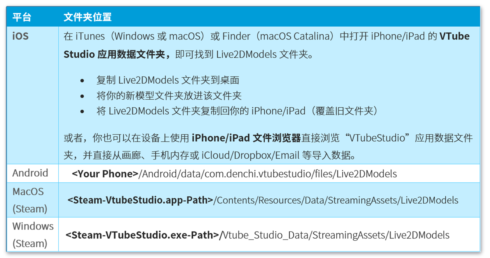

# VTube Studio 导入自定义 Live2D 模型指南
VTube Studio 内置了若干示例模型，其中绝大多数的版权归属于 Live2D Inc.。因此，若你打算在直播中使用这些模型，请务必阅读 **[《隐私政策与许可》](Privacy-Policy,-Licensing-and-Further-Terms.md)** 章节。

本章节将介绍如何将你自制的 Live2D 模型载入 VTube Studio。阅读本章的前提是，你已完成 Live2D 模型的制作，并且对 Live2D 及其运作原理（如 Live2D 参数）具备基础认知。

## 我可以在哪里获得模型？
如果你想了解如何获取（或制作）可用于 VTube Studio 的模型，请查看 [此页面](Models.md)。

## 为 VTube Studio 准备你的 Live2D 模型
实际上，你无需为了让 Live2D 模型适配 VTube Studio 而进行任何特殊准备。正如稍后 **“VTS 参数设置”** 章节中所阐述的，你可以将任意面部追踪参数映射到任意 Live2D 参数上，因此理论上你可以自主选择参数 ID 及其范围。

不过，我们仍然建议你遵循默认的参数 ID 与参数范围（最小值/最大值）。同时需要注意，对 VTube Studio 而言，只有 Live2D 的参数 ID 是关键信息，参数名并不起作用。

当你的模型制作完毕后，请通过 **文件→导出运作档→导出为 .moc3 文件** 的流程导出模型。

导出时请务必确认以下设置：

* “输出版本” 设置为 “SDK 3.0”“SDK 3.3”“SDK 4.0”“SDK 5.0” 或更高版本。测试版 SDK 可能不受支持，请谨慎选择。

* 勾选 “导出物理模拟设定文件（physics3.json）”。若不导出该文件，你的模型将不具备物理效果。请务必通过此方式导出物理文件，切勿与模型单独导出，因为这是唯一能确保物理文件在 `.model3.json` 文件中完成“注册”、并被 VTube Studio 识别调用的方法。若物理文件未完成注册，VTube Studio 会调用它在模型文件夹中找到的第一个物理文件。

* 输出类型：SDK

导出操作完成后，会生成一个包含以下文件的文件夹（忽略标红文件）。若后续模型无法在 VTube Studio 中加载，请检查是否存在文件缺失的情况。

以下是这些文件的功能概述：

* **\<model\>.model3.json**
  
  主要的 Live2D 模型索引文件。
  
  人类可读（可在文件编辑器中打开/编辑）。
  
  包含所有其他文件的引用路径，是 VTube Studio 识别模型的核心文件。

* **\<model\>.moc3**
  
  模型的二进制文件。包含顶点、变形器、参数等所有模型核心数据。

* **\<model\>.cdi3.json**
  
  模型显示信息文件。VTube Studio 暂不调用此文件。
  
  人类可读。

* **\<model\>.physics3.json**
  
  存储物理设置的所有相关信息。
  
  人类可读。

* **\<model\>.\<resolution\>（示例：akari.4096）**

  包含模型的纹理文件。VTube Studio 同样支持多纹理及高清纹理模型。请注意，在移动设备上使用高清纹理可能会导致应用卡顿甚至崩溃。

进行下一步操作前，请确保上述所有文件都已放入同一文件夹。我通常会将该文件夹命名为 **\<model\>_vts**，你也可以自定义文件夹名称。

若你需要为模型添加 Live2D 动画与表情，请将相关文件放入该文件夹或其子文件夹中（参考上方截图中的两个子文件夹）。表情与动画的具体使用方法将在后续章节中介绍。此外，你还可以在文件夹内添加一个模型图标（支持任意文件名，格式为 .png 或 .jpg，推荐尺寸 512×512 像素）。

## 将你的 Live2D 模型载入 VTube Studio
将你的模型文件夹放入 VTube Studio 的 “Live2DModels” 文件夹中。该文件夹的路径会因平台而异，在 Steam 版本中，你可以点击以下按钮直接打开该文件夹：

启动 VTube Studio。软件启动后，会自动找寻新的 Live2D 模型文件，并在同一文件夹中新建一个 VTube Studio 模型配置文件（VTS 模型，文件名为 **\<Live2D-Model-Name\>.vtube.json**）。该文件为人类可读格式，包含了你的 VTube Studio 模型的所有设置信息。

此时，你应该能在模型选择栏中看到你的模型。若未显示，请确认文件是否齐全，同时检查日志中是否存在报错信息。

## 在 iPhone/Android 上获取模型

**注意：** 如果你仅使用手机进行面部追踪，无需在手机上安装模型文件；但如果需要用手机制作用于 Twitter/TikTok 的短视频，在手机端导入模型会更为便捷。

你可以通过上述手动方式将模型载入手机。此外，VTube Studio 现已支持将模型从 PC/Mac 直接传输至智能手机。操作方法：在电脑端打开目标模型，通过 WiFi 或 USB 连接手机，然后点击对应传输按钮即可。

> 注意：若你的手机中已存在同名模型，传输后将会直接覆盖原有文件。

## 自动设置
首次载入新的 Live2D 模型时，软件会提示你运行 “自动设置”。模型加载完成后，你也可以在设置界面的模型一栏中手动触发该功能。

运行自动设置时，VTube Studio 会自动在模型中查找默认 Live2D 参数。该功能默认你使用了标准的 Live2D 参数 ID 与参数名，并据此完成 VTube Studio 的参数配置。你可以通过以下链接查看更多关于默认参数 ID 的内容：https://docs.live2d.com/zh-CHS/cubism-editor-manual/standard-parameter-list

若你的模型未使用默认参数 ID，则需要手动完成配置，具体方法将在 **“VTS 参数设置”** 章节中详细说明。

除此之外，你还可以在此菜单中从其他模型复制配置，包括参数设置、表情、动画等所有内容。如需了解更多详情，请查看 [《在模型间复制配置》](Copy-config-between-models.md) 章节。

至此，你的模型已经可以正常使用了。当然，你可能还需要进行一些细节微调，但模型已经能够响应动捕数据。在 iOS 设备上，首次安装应用后，你可能需要先打开相机预览功能，模型才能正常运动。

整个操作流程也可参考以下视频教程：

**[VTube Studio] 载入自定义 Live2D 模型 -** https://www.youtube.com/watch?v=AssUd6EtFXw