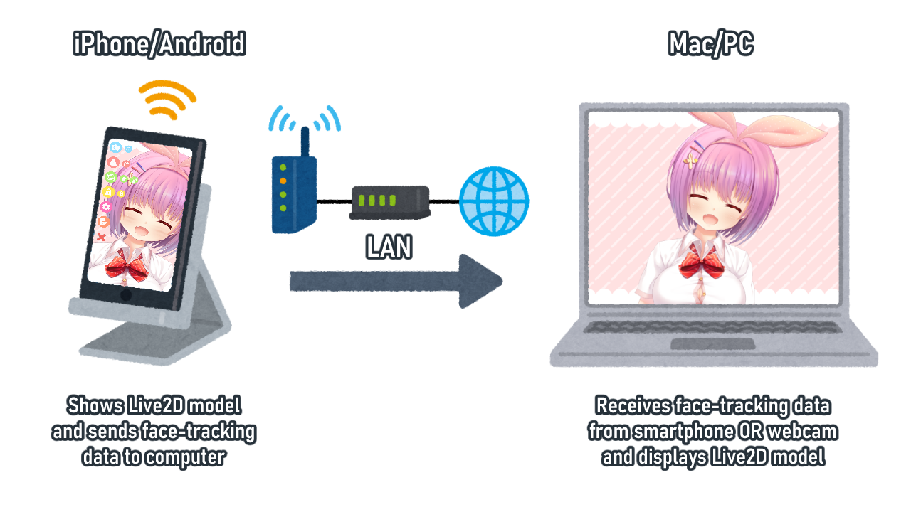

[{width=630px}](https://github.com/Mouwoo/VTubeStudio/wiki)

## 欢迎使用 VTube Studio 手册!!

VTube Studio (或称VTS)是一款可使用你的手机或网络摄像头进行面部捕捉，并相应地对 [Live2D Cubism 模型](https://www.live2d.com/zh-CHS/) 进行动画处理的软件。模型将直接显示在你的手机上，或通过本地网络将面部追踪数据从手机传输到你的PC上。

{height=59px width=189px} 
在捕捉质量方面, **iOS > Webcam > Android**

**注意: VTube Studio 不支持3D模型**

如果你想使用3D模型，VTube Studio ***将无法*** 满足你的需求。请考虑使用 [VSeeFace](https://www.vseeface.icu/) 来满足你的面捕需求。但是你可以使用VTS通过高质量的iOS跟踪来控制VSeeFace中的3D模型。[有关更多信息请点击此处](Sending-data-to-VSeeFace.md)

## 在哪下载

VTube Studio 有两个版本: 智能手机应用程序（Android 或 iOS）和Steam上的桌面应用程序（Windows 或 macOS）。如果你使用网络摄像头进行面部跟踪，则不需要智能手机应用程序。你可以从以下链接下载你想要的 VTube Studio 版本：

[{width=220px}](https://store.steampowered.com/app/1325860/VTube_Studio/)
[{width=220px}](https://apps.apple.com/us/app/vtube-studio/id1511435444)
[{width=220px}](https://play.google.com/store/apps/details?id=com.denchi.vtubestudio)

* **桌面版 (Steam)**
  * Windows/macOS: [https://store.steampowered.com/app/1325860/VTube_Studio/](https://store.steampowered.com/app/1325860/VTube_Studio/)
* **智能手机**
  * iOS: [https://apps.apple.com/us/app/vtube-studio/id1511435444](https://apps.apple.com/us/app/vtube-studio/id1511435444)
  * Android: [https://play.google.com/store/apps/details?id=com.denchi.vtubestudio](https://play.google.com/store/apps/details?id=com.denchi.vtubestudio)

感谢你尝试VTube Studio!! :two_hearts:

## Getting Started

如果你是 VTube Studio 的新手，请查看以下的开始教程:

* [硬件要求](Introduction-&-Requirements.md)
* [入门 VTube Studio](Getting-Started.md)
* [为VTube Studio 设置 VSeeFace](Sending-data-to-VSeeFace.md)
* [常见问题](FAQ.md)

## 需要帮助?

如果你有疑问, 可以先查看 [常见问题解答](FAQ.md)! 如果常见问题解答未能解决你的问题，或者你想联系其他事宜，请联系Discord。

* [Discord](https://discord.gg/vtubestudio)
* [Twitter](https://twitter.com/VTubeStudio)
* [邮件](mailto:denchi@denchisoft.com)
* [官网](https://denchisoft.com)

## 对于开发人员
想要创建你自己的应用程序来接收来自 VTube Studio 的跟踪数据吗？看看 [这个页面](https://github.com/DenchiSoft/VTubeStudioBlendshapeUDPReceiverTest) ❤️

## 特别感谢

感谢 **ebikatsudon** 整理了一些手册页面并编写了 [入门](Getting-Started.md) 页面!!

**译者注：因为原中文翻译版本太久没有更新所以我制作了这个最新版手册的中文翻译，该版本基于英文版手册与原中文版手册。**   

**原中文翻译版本：**   
[https://github.com/Elegetic/VTubeStudio/wiki](https://github.com/Elegetic/VTubeStudio/wiki)

